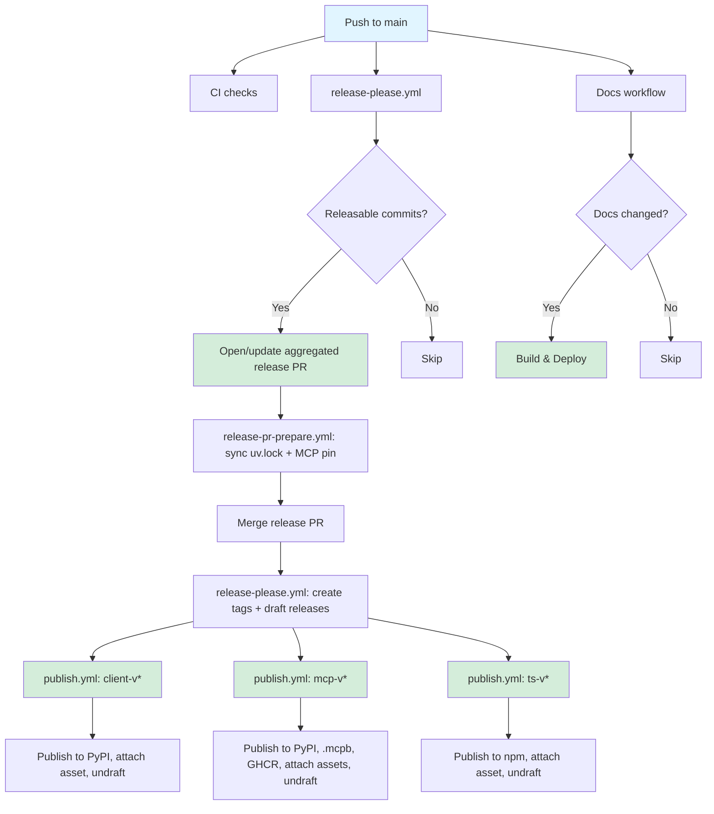

# GitHub Actions Workflows

This directory contains the CI/CD workflows for the StatusPro OpenAPI Client project.

## Workflows

### [ci.yml](ci.yml)

**Trigger:** Pull requests to `main` branch

**Purpose:** Continuous integration checks for pull requests

**Steps:**

- Install dependencies with uv
- Run full CI pipeline (`uv run poe ci`)
  - Format checking
  - Linting (ruff, mypy, yamllint)
  - Tests with coverage
  - OpenAPI validation

**Permissions:** `contents: read`

### [docs.yml](docs.yml)

**Trigger:**

- Push to `main` branch (when docs-related files change)
- Manual workflow dispatch

**Purpose:** Build and deploy documentation to GitHub Pages

**Steps:**

- Build MkDocs documentation
- Upload documentation artifacts
- Deploy to GitHub Pages

**Permissions:** `contents: read`, `pages: write`, `id-token: write`

**Note:** This workflow only runs when documentation files change (docs/\*\*,
mkdocs.yml, etc.) to avoid unnecessary builds.

### [release-please.yml](release-please.yml)

**Trigger:** Push to `main` branch

**Purpose:** The only workflow that watches `main` for release purposes. Runs
[release-please](https://github.com/googleapis/release-please) in manifest mode
(`release-please-config.json` / `.release-please-manifest.json`) to open/update one
aggregated release PR covering all three packages, or — once that PR has merged — create
tags (`client-v*`, `mcp-v*`, `ts-v*`) and draft GitHub Releases at the merge commit.
Never pushes to `main` itself.

**Permissions:** `contents: write`, `pull-requests: write`

### [release-pr-prepare.yml](release-pr-prepare.yml)

**Trigger:** `pull_request` events, filtered to release-please's own PR branch
(`release-please--*`, same-repo only)

**Purpose:** Resyncs `uv.lock` and the MCP server's `statuspro-openapi-client>=X` floor
to match the versions the release PR proposes, committing the result back to the release
PR branch — never to `main`.

**Permissions:** `contents: write`

### [publish.yml](publish.yml)

**Trigger:** Push of a `client-v*`, `mcp-v*`, or `ts-v*` tag

**Purpose:** The only workflow that builds and publishes artifacts. Per-component jobs
build the package (the MCP job also builds the `.mcpb` bundle), publish it to the
registry via OIDC (PyPI/npm Trusted Publishers — no tokens), upload the built asset(s)
to the still-draft GitHub Release, then flip the release to published.
`publish-mcp-docker` additionally builds and pushes a multi-arch image to GHCR after
`publish-mcp` succeeds.

**Note:** No `environment:` is set on any job — statuspro's PyPI Trusted Publishers were
registered with a blank environment, and adding one here would break OIDC matching. See
[RELEASE.md](../../docs/RELEASE.md#trusted-publisher-environments-deviation-from-other-repos-in-this-migration).

**Permissions:**

- `publish-client` / `publish-mcp` / `publish-ts`: `id-token: write`, `contents: write`
- `publish-mcp-docker`: `contents: read`, `packages: write`

See [RELEASE.md](../../docs/RELEASE.md) for the full release process.

### [security.yml](security.yml)

**Trigger:** Weekly schedule (Sundays at 00:00 UTC)

**Purpose:** Security scanning and dependency audits

**Steps:**

- Dependency vulnerability scanning
- Code security analysis
- License compliance checks

**Permissions:** `contents: read`, `security-events: write`

### [copilot-setup-steps.yml](copilot-setup-steps.yml)

**Type:** Reusable workflow

**Purpose:** Common setup steps for GitHub Copilot integrations

**Provides:**

- Dependency installation
- Environment configuration
- Caching setup

## Workflow Orchestration



## Configuration

### Secrets Required

- `GITHUB_TOKEN` - Automatically provided by GitHub Actions
- PyPI publishing uses Trusted Publishers (no manual tokens needed)

### Environments

- **PyPI Release** - Protected environment for PyPI publishing
  - URL: https://pypi.org/p/statuspro-openapi-client
- **github-pages** - GitHub Pages deployment environment

### Branch Protection

- `main` branch requires:
  - CI checks to pass
  - Up-to-date branches
  - No direct pushes (PRs only)

## Local Testing

Test workflows locally using [act](https://github.com/nektos/act):

```bash
# Test CI workflow
act pull_request -W .github/workflows/ci.yml

# Test docs build (without deploy)
act workflow_dispatch -W .github/workflows/docs.yml

# Test release-please (dry-run)
act push -W .github/workflows/release-please.yml
```

## Maintenance

### Updating Actions

Keep actions up to date by:

1. Monitoring Dependabot alerts
1. Reviewing action changelogs
1. Testing in a branch before merging

### Adding New Workflows

When adding new workflows:

1. Create the workflow file
1. Update this README
1. Test locally with `act`
1. Create a PR for review
1. Update branch protection rules if needed

## Troubleshooting

### Common Issues

**No release PR opens/updates:**

- Ensure the `dougborg-release-please` GitHub App is installed and its
  `RELEASE_PLEASE_APP_ID`/`RELEASE_PLEASE_APP_PRIVATE_KEY` credentials are valid
- Ensure commits follow conventional commit format and touch a watched path (`.`,
  `statuspro_mcp_server/`, or `packages/statuspro-client/`)
- Review `release-please.yml` run logs

**`uv.lock` or MCP pin stale on the release PR:**

- Check the `release-pr-prepare.yml` run for that PR branch

**Docs not deploying:**

- Check that `docs/**` files were actually changed
- Verify GitHub Pages is enabled in repository settings
- Check workflow logs for build errors

**PyPI/npm publish failing:**

- Verify the Trusted Publisher is configured for that package on PyPI/npm, with no
  `environment` set (see [RELEASE.md](../../docs/RELEASE.md))
- Check that a draft release for the tag was actually created
- Review PyPI/npm status pages for outages

### Debug Mode

Enable workflow debug logging:

```bash
# In repository settings > Secrets and variables > Actions
# Add repository secret:
ACTIONS_STEP_DEBUG=true
ACTIONS_RUNNER_DEBUG=true
```

## Links

- [GitHub Actions Documentation](https://docs.github.com/en/actions)
- [uv Documentation](https://docs.astral.sh/uv/)
- [release-please](https://github.com/googleapis/release-please)
- [MkDocs](https://www.mkdocs.org/)
